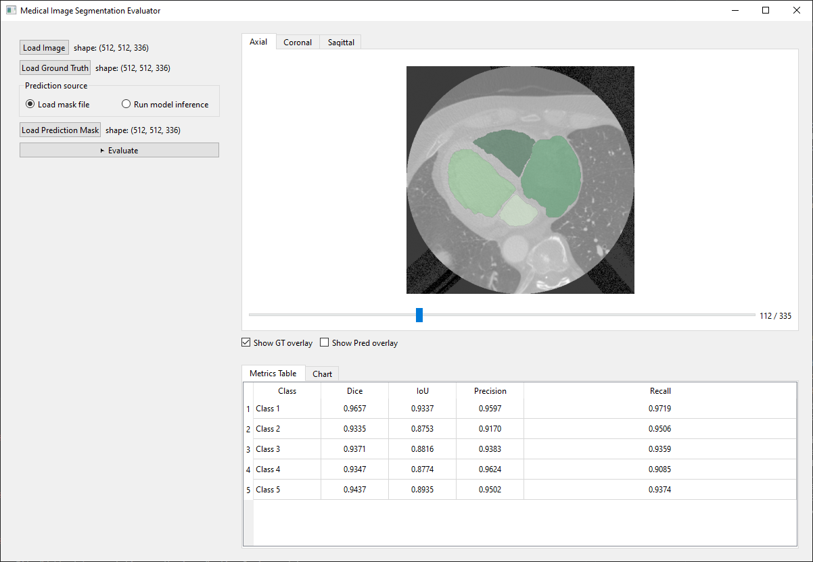

# Medical Image Segmentation Evaluator

A desktop GUI for inspecting 3D medical image segmentations and evaluating prediction masks against ground-truth labels.

The app supports loading image volumes, ground-truth masks, and prediction masks from NIfTI files or DICOM folders. It displays axial, coronal, and sagittal slices with configurable GT/prediction overlays, then reports per-class Dice, IoU, precision, and recall.



## Features

- Load 3D image volumes from NIfTI (`.nii`, `.nii.gz`) or DICOM series folders.
- Load ground-truth and prediction segmentation masks.
- View slices in axial, coronal, and sagittal orientations.
- Toggle green ground-truth and red prediction overlays.
- Compute per-class Dice, IoU, precision, and recall.
- Review results in both a table and bar chart.
- Optionally run ONNX or PyTorch model inference to generate a prediction mask.

## Installation

Python 3.11+ is recommended.

```powershell
git clone https://github.com/jingW-0/Segmentation_evaluator.git
cd Segmentation_evaluator
python -m venv .venv
.\.venv\Scripts\Activate.ps1
pip install -r requirements.txt
```

If installing `torch` from `requirements.txt` does not match your hardware or Python version, install the correct PyTorch build from the official PyTorch instructions, then reinstall the remaining requirements.

## Usage

Run the application from the project directory:

```powershell
python main.py
```

Basic evaluation workflow:

1. Click **Load Image** and select a NIfTI file. If you cancel the file dialog, the app will offer a DICOM folder picker.
2. Click **Load Ground Truth** and load the reference segmentation mask.
3. Choose the prediction source:
   - **Load mask file**: load an existing prediction mask.
   - **Run model inference**: load an ONNX or PyTorch model and run it on the image volume.
4. Click **Evaluate**.
5. Review the per-class metrics in the results table or chart.

Ground truth and prediction masks must have the same shape. Metrics are computed for non-zero labels present in the ground-truth mask.

## Model Inference

The inference panel supports:

- ONNX models via `onnxruntime`
- PyTorch models via `torch.load`
- Z-score or min-max input normalization

Current model input expectation:

```text
(1, 1, H, W, D)
```

If the model returns a 5D tensor shaped like `(1, C, H, W, D)`, the app applies `argmax` across the class channel. Otherwise, it treats the first output item as the predicted label volume.

## Metrics

For each non-background class, the evaluator computes:

- Dice
- Intersection over Union (IoU)
- Precision
- Recall

Background label `0` is ignored by default.

## Project Layout

```text
segmentation_eval/
+-- gui/                 # PyQt6 application panels
+-- inference/           # ONNX and PyTorch inference wrappers
+-- io/                  # NIfTI and DICOM readers
+-- metrics/             # Segmentation metric functions
+-- utils/               # Label helpers
+-- example/             # Example screenshot
+-- main.py              # Application entry point
+-- requirements.txt     # Python dependencies
```

## Notes

- NIfTI volumes are reoriented to canonical RAS orientation before display.
- DICOM series are sorted by `InstanceNumber`.
- This tool is intended for local evaluation and visualization workflows.
